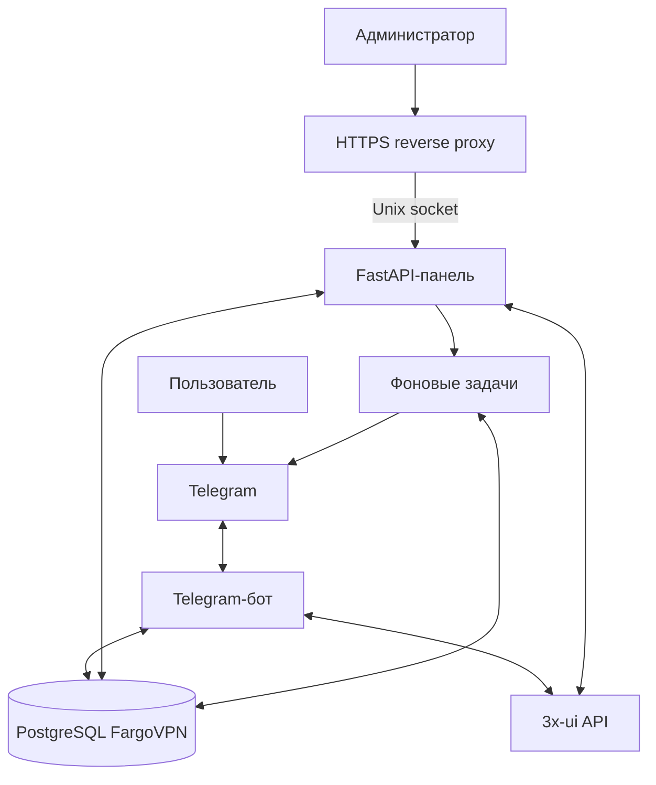
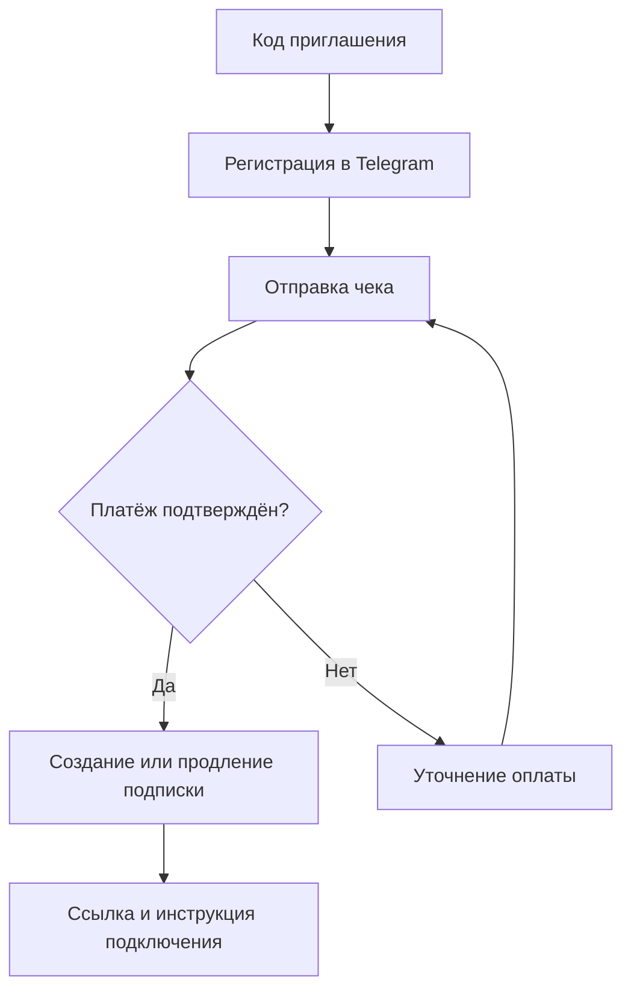
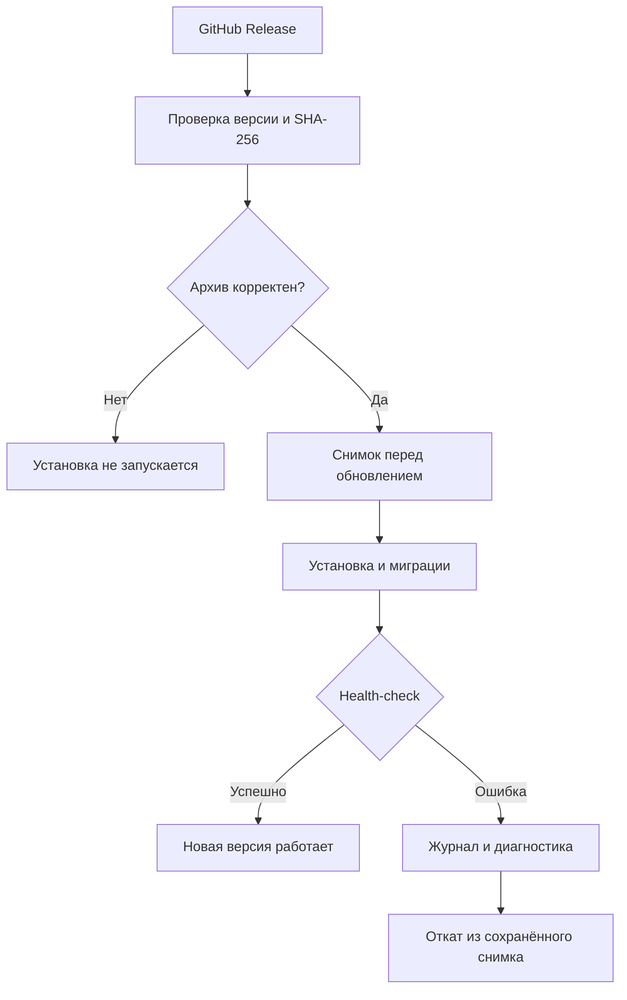

# FargoVPN 5.0.0

<div align="center">

### Telegram · VPN-подписки · Панель управления

Одна платформа для пользователей, платежей, сообщений и обслуживания VPN.

[](./VERSION)


[](./LICENSE)

[Установка](#быстрая-установка) · [Архитектура](#архитектура) · [Обновления](#обновление-и-откат) · [FAQ](#диагностика-и-faq) · [История версий](./CHANGELOG.md)

</div>

---

FargoVPN — персональная платформа управления VPN-подписками через Telegram-бота и веб-панель с интеграцией 3x-ui. Пользователь регистрируется, оплачивает подписку и получает ссылку подключения; администратор управляет сервисом из одного интерфейса.

> **В версии 5.0.0:** исправлены рассылка из панели, фильтр/сортировка пользователей, диагностика PostgreSQL и установщик; удалён профиль установки. [Изменения →](./CHANGELOG.md)

## Возможности

| | Раздел | Что доступно |
|:--:|---|---|
| 🤖 | Telegram-бот | Регистрация по коду, кабинет, продление, напоминания и поддержка |
| 💳 | Оплата | Приём чеков, OCR-проверка и подтверждение платежей |
| 🛠️ | Веб-панель | Пользователи, оплаты, настройки, журналы и диагностика |
| 💬 | Сообщения | Live-обновления диалогов, непрочитанные сообщения, ответы и рассылки |
| 🔗 | 3x-ui | Управление клиентами через API и выбор нескольких inbound |
| 🎟️ | Приглашения | Коды регистрации с защитой от перебора и реферальная программа |
| 📦 | Резервные копии | `.tar.gz`, разделение больших архивов, доставка в Telegram и восстановление |
| 🚀 | Обновления | GitHub Releases, проверка SHA-256, фоновая установка и откат |
| 🔔 | Уведомления | Web Push и напоминания об окончании подписки |

## Архитектура



PostgreSQL хранит данные платформы. Бот и панель обращаются к 3x-ui через API; длительные операции выполняют отдельные workers. HTTPS завершается на внешнем reverse proxy, который передаёт запросы панели через Unix-сокет.

### От регистрации до подключения



## Требования

Поддерживаемая установщиком среда — сервер Ubuntu/Debian с `systemd`. Основной runtime использует Python, PostgreSQL, SQLAlchemy/psycopg и HTTP-клиенты. OCR требует Tesseract. Для web-панели нужен Unix-сокет, а внешний reverse-proxy/Nginx, если он используется, настраивается отдельно от FargoVPN.

Точный перечень Python-зависимостей находится в `requirements.txt`. Рекомендуется выделять отдельный серверный runtime и не переносить production `config.py` в репозиторий.

## Быстрая установка

```bash
curl -fsSL https://raw.githubusercontent.com/Menshikovivan/FargoVPN/main/install.sh | sudo bash
```

Установщик проверяет root/systemd, зависимости, целостность скачанного архива и его SHA-256, затем запускает штатную установку. В конце отображается итоговая сводка по установленной версии, web-панели, службам и health-check.

## Конфигурация

<details>
<summary><b>Параметры подключения, безопасности и обслуживания</b></summary>


| Параметр | Назначение |
|---|---|
| `SERVICE_NAME` | Отображаемое имя сервиса. |
| `BOT_TOKEN` | Токен Telegram-бота; хранить только вне публичного репозитория. |
| `ADMIN_IDS` | Telegram ID администраторов. |
| `DATABASE_URL` | PostgreSQL DSN FargoVPN. |
| `DATABASE_POOL_SIZE`, `DATABASE_MAX_OVERFLOW`, `DATABASE_POOL_TIMEOUT` | Параметры пула PostgreSQL. |
| `BASE_URL`, `MASTER_API_URL`, `SUB_BASE_URL` | Адреса web/3x-ui/подписок. |
| `MASTER_API_TOKEN` | Секрет API 3x-ui. |
| `PAYMENT_PRICE`, `PAYMENT_PHONE`, `PAYMENT_BANK`, `PAYMENT_RECEIVER` | Реквизиты и цена оплаты. |
| `RECEIPT_*` | OCR, фильтры чеков и ограничения их обработки. |
| `WEB_HOST`, `WEB_SOCKET_PATH`, `WEB_SOCKET_GROUP` | Параметры web-сервиса и Unix-сокета. |
| `WEB_PUBLIC_PREFIX`, `WEB_DOMAIN`, `WEB_TLS_SERVER_NAME` | Публичный путь и доменные настройки. |
| `WEB_USERNAME`, `WEB_PASSWORD_HASH`, `WEB_SECRET_KEY` | Учётная запись и сессии web-панели. |
| `WEB_COOKIE_HTTPS_ONLY`, `WEB_SESSION_MAX_AGE_SECONDS` | Безопасность и срок web-сессии. |
| `CABINET_LINK_TTL_SECONDS`, `CABINET_ALLOW_LEGACY_TOKENS` | Ссылки и совместимость личного кабинета. |
| `WEB_LOGIN_*` | Лимиты и блокировки входа. |
| `XUI_DB_PATH`, `XUI_PANEL_URL`, `XUI_CACHE_SECONDS`, `XUI_VERIFY_TLS`, `XUI_REQUEST_TIMEOUT_SECONDS` | Подключение и кэширование 3x-ui. |
| `XUI_MANAGED_INBOUND_IDS`, `XUI_INBOUND_CACHE_SECONDS` | Список управляемых inbound и его кэш. |
| `REMINDER_DAYS`, `REMINDER_LOCK_PATH` | Напоминания о подписке. |
| `USER_EVENT_*` | Срок хранения и очередь журнала сообщений. |
| `CHAT_MEDIA_*` | Кэш и лимиты медиа сообщений. |
| `BROADCAST_*` | Рассылки, размер медиа, задержка и stale timeout. |
| `SUBSCRIPTION_REFRESH_*` | Массовое обновление ссылок подписки. |
| `PUSH_*` | Web Push, VAPID и лимиты подписок. |
| `BACKUP_*` | Каталог, интервал, размер частей, lock и состояние backup. |
| `RESTORE_*` | Lock, журнал и лимиты безопасного восстановления. |
| `XUI_POSTGRES_DSN`, `XUI_DB_ENV_FILE` | Параметры отдельной БД 3x-ui при необходимости. |
| `GITHUB_API_BASE_URL`, `GITHUB_API_TOKEN` | GitHub API для канала обновлений. |
| `GITHUB_REPOSITORY_OWNER`, `GITHUB_REPOSITORY_NAME` | Репозиторий обновлений. |
| `GITHUB_TARGET_BRANCH`, `GITHUB_RELEASE_*` | Параметры GitHub Release. |
| `GITHUB_MAIN_SYNC_ENABLED` | Включение синхронизации публичной поверхности. |
| `UPDATE_DIR`, `UPDATE_CHECK_INTERVAL`, `UPDATE_VERIFY_TLS`, `UPDATE_MAX_ARCHIVE_MB`, `UPDATE_STALE_JOB_SECONDS` | Каталог, проверки и лимиты обновлений. |

Полный список исходных ключей с базовыми значениями находится в `config.example.py`. Реальные секреты и production-ID в README не приводятся.


</details>

## Подключение клиентов

В личном кабинете раздел «Как подключиться» формирует deep-link вида `happ://add/...` или `incy://add/...`. В интерфейсе доступны HAPP и INCY для Android, iPhone/iPad и Windows-сценариев. Если deep-link не открывается, ссылку подписки можно скопировать вручную.

## Пользовательские сценарии

1. Пользователь открывает бота и проходит приглашение по 4-значному коду.
2. После активации открывается кабинет и выдаётся подписка при наличии соответствующего состояния.
3. Оплата отправляется через Telegram, чек проверяется и обрабатывается панелью.
4. После подтверждения подписки пользователь получает актуальную ссылку и инструкцию подключения.

## Администратор

В панели доступны разделы пользователей, сообщений, оплат, мониторинга, backup, журналов, настроек, диагностики и обновлений. Для операций с клиентами используется локальная БД FargoVPN и API 3x-ui.

## Backup и восстановление

Полный backup создаётся одной штатной службой `vpn-service-backup.service`, планирование выполняется `vpn-service-backup.timer`. Архив имеет формат `.tar.gz`; крупный файл делится на последовательные части. Restore проверяет состав частей, контрольные суммы и безопасность путей до применения данных.

Режимы восстановления: пользовательская БД или полное состояние системы. Перед полным восстановлением предусмотрены защитный backup и проверка результата.

## Обновление и откат

Канал обновлений использует GitHub Releases. Перед применением проверяются версия, имя архива, размер и SHA-256; установка выполняется фоновым worker-процессом. Для rollback используется сохранённый pre-update архив.



Откат запускается отдельной административной операцией. Публикация доступна назначенной главной панели; обычные панели получают релизы из GitHub.

## Структура репозитория

| Файл или каталог в полном архиве | Назначение |
|---|---|
| `main.py` · `webapp.py` | Telegram-бот и FastAPI-панель |
| `db.py` · `init_db.py` · `migrations/` | PostgreSQL и миграции |
| `services/` | 3x-ui, подписки, OCR и медиа |
| `broadcast_*.py` · `subscription_refresh_*.py` | Рассылки и обновление подписок |
| `backup.py` · `restore_*.py` | Резервное копирование и восстановление |
| `update_*.py` · `rollback_worker.py` | Установка версий и откат |
| `static/` | Стили, JavaScript и иконки |
| `scripts/` · `*.service` · `*.socket` | Сервисные скрипты и systemd |
| `tests/` · `requirements-dev.txt` | Регрессионные проверки |
| `config.example.py` | Шаблон конфигурации |

На главной ветке GitHub штатная публикация оставляет публичную документацию, установщик, версию и полный архив с SHA-256. Исходный код и тесты находятся внутри полного архива.

## Безопасность

Не храните Telegram Bot Token, API-токены 3x-ui, пароли PostgreSQL, VAPID private key и production-конфигурацию в Git. Для ручного восстановления используйте только доверенные архивы. Не подключайте произвольные reverse-proxy правила к панели без проверки маршрутизации и TLS. Рекомендации описаны в [SECURITY.md](./SECURITY.md).

## Диагностика и FAQ

**«Диалог не начат»** — Telegram отклонил сообщение или чат недоступен. В массовой рассылке такой чат фиксируется как недоступный и исключается из следующих запусков до нового входящего сообщения.

**Push не включается** — проверьте HTTPS, разрешение уведомлений браузера, VAPID-конфигурацию и доступность push endpoint.

**Версия не меняется после обновления** — проверьте `VERSION`, `app/VERSION`, статус update-worker и `/healthz`.

**3x-ui недоступна** — панель умеет показывать локальный snapshot; отдельно проверьте URL 3x-ui, TLS и timeout.

**Где смотреть логи?** — основной application log: `/var/log/vpn_bot.log`; restore пишет в отдельный журнал, а состояния фоновых задач находятся в `/var/lib/vpn-service`.

## English summary

FargoVPN is a personal-use Telegram VPN subscription platform with a FastAPI admin panel and 3x-ui integration. It provides invitation-gated registration, payments/receipt handling, subscriptions, messaging, broadcasts, Web Push, backup/restore, and GitHub Release based updates.

## Вклад в проект

Для изменений сначала добавляйте regression test, затем проверяйте `compileall`/`pytest` и shell syntax. Production-секреты и персональные данные в PR не добавляются.

## Лицензия

FargoVPN распространяется по условиям `LICENSE` — Personal Use License. Для использования за пределами разрешённых условий требуется отдельное разрешение правообладателя.

## Ответственное использование

Используйте проект только в соответствии с законодательством, правилами провайдера и применимыми условиями сервисов, с которыми он интегрируется.

## Обновление 5.0.0

Исправлены повторные чеки, статус подписки и медиа в переписке; добавлен диапазон дат регистрации и пагинация списка пользователей.
Исторические платежи не переписываются. Актуальные миграции базы выполняются штатным `init_db.py`.
После обновления установщик обновляет управляемый location Nginx. Если используете собственный reverse proxy, разрешите размер тела запроса для фото и multipart overhead.
Открытую до обновления оплату нужно заново открыть через кнопку покупки: состояние FSM хранится в памяти.
Подробности, изменённые файлы и ручные проверки: [TEST_REPORT_5.0.0.md](./TEST_REPORT_5.0.0.md).
Для запуска тестов: `python -m pip install -r requirements-dev.txt`, затем `python -m pytest tests -q`.
Релизный asset: `VPN_Service_Platform_5.0.0_FULL.tar.gz`; стандартный tag: `FargoVPN-5.0.0`.
Используйте штатную публикацию архива на основной панели или загрузите архив в GitHub Releases.
Описание публикации формируется только из раздела 5.0.0 в `CHANGELOG.md`. Старые разделы остаются в файле как история.
