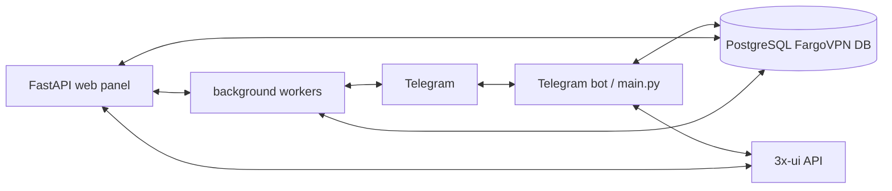

# FargoVPN 4.9

<!-- Место под баннер/логотип -->

[](./VERSION)
[](./requirements.txt)
[](./LICENSE)
[](./CHANGELOG.md)

FargoVPN — персональная платформа управления VPN-подписками через Telegram-бота и web-панель администратора с интеграцией 3x-ui. Проект рассчитан на самостоятельную установку на собственный сервер; production-секреты находятся вне репозитория.

## Возможности

### Telegram-бот
- регистрация по 4-значному коду приглашения с защитой от перебора;
- личный кабинет, подписка, продление и уведомления;
- приём чеков и OCR-проверка;
- реферальная программа;
- поддержка Telegram-сообщений и массовых рассылок;
- ссылки подписки и запуск VPN-клиента через deep-link.

### Web-панель
- пользователи и привязки Telegram;
- платежи и просмотр чеков;
- сообщения с live-обновлением, unread-счётчиками и исходящими ответами;
- мониторинг и диагностика;
- настройки бота, платежей, 3x-ui, Web Push и обновлений;
- создание и восстановление backup;
- проверка, установка и откат версий.

### 3x-ui и подписки
- создание и управление клиентами через API 3x-ui;
- новый клиент создаётся без заданного `flow`;
- поддерживается работа с несколькими inbound;
- ссылки подписки формируются для используемых конфигураций и deep-link приложений HAPP/INCY.

### Backup / restore
- полный архив в формате `.tar.gz`;
- разбиение большого архива на части;
- Telegram-доставка;
- восстановление только пользовательских данных или полного состояния;
- проверка структуры, контрольных сумм и защита от path traversal.

## Архитектура



## Требования

Поддерживаемая установщиком среда — сервер Ubuntu/Debian с `systemd`. Основной runtime использует Python, PostgreSQL, SQLAlchemy/psycopg и HTTP-клиенты. OCR требует Tesseract. Для web-панели нужен Unix-сокет, а внешний reverse-proxy/Nginx, если он используется, настраивается отдельно от FargoVPN.

Точный перечень Python-зависимостей находится в `requirements.txt` и `requirements-lite.txt`. Рекомендуется выделять отдельный серверный runtime и не переносить production `config.py` в репозиторий.

## Быстрая установка

```bash
curl -fsSL https://raw.githubusercontent.com/Menshikovivan/FargoVPN/main/install.sh -o /tmp/fargovpn-install.sh
sudo bash /tmp/fargovpn-install.sh
```

Установщик проверяет root/systemd, зависимости, целостность скачанного архива и его SHA-256, затем запускает штатную установку. В конце отображается итоговая сводка по установленной версии, web-панели, службам и health-check.

## Конфигурация

| Параметр | Назначение |
|---|---|
| `INSTALL_PROFILE` | Профиль установки `full`/`lite`. |
| `SERVICE_NAME` | Отображаемое имя сервиса. |
| `BOT_TOKEN` | Токен Telegram-бота; хранить только вне публичного репозитория. |
| `ADMIN_IDS` | Telegram ID администраторов. |
| `DATABASE_URL` | PostgreSQL DSN FargoVPN. |
| `DATABASE_POOL_SIZE`, `DATABASE_MAX_OVERFLOW`, `DATABASE_POOL_TIMEOUT` | Параметры пула PostgreSQL. |
| `BASE_URL`, `MASTER_API_URL`, `SUB_BASE_URL` | Адреса web/3x-ui/подписок. |
| `MASTER_API_TOKEN` | Секрет API 3x-ui. |
| `PAYMENT_PRICE`, `PAYMENT_PHONE`, `PAYMENT_BANK`, `PAYMENT_RECEIVER` | Реквизиты и цена оплаты. |
| `RECEIPT_*` | OCR, фильтры чеков и ограничения их обработки. |
| `WEB_HOST`, `WEB_SOCKET_PATH`, `WEB_SOCKET_GROUP` | Параметры web-сервиса и Unix-сокета. |
| `WEB_PUBLIC_PREFIX`, `WEB_DOMAIN`, `WEB_TLS_SERVER_NAME` | Публичный путь и доменные настройки. |
| `WEB_USERNAME`, `WEB_PASSWORD_HASH`, `WEB_SECRET_KEY` | Учётная запись и сессии web-панели. |
| `WEB_COOKIE_HTTPS_ONLY`, `WEB_SESSION_MAX_AGE_SECONDS` | Безопасность и срок web-сессии. |
| `CABINET_LINK_TTL_SECONDS`, `CABINET_ALLOW_LEGACY_TOKENS` | Ссылки и совместимость личного кабинета. |
| `WEB_LOGIN_*` | Лимиты и блокировки входа. |
| `XUI_DB_PATH`, `XUI_PANEL_URL`, `XUI_CACHE_SECONDS`, `XUI_VERIFY_TLS`, `XUI_REQUEST_TIMEOUT_SECONDS` | Подключение и кэширование 3x-ui. |
| `XUI_MANAGED_INBOUND_IDS`, `XUI_INBOUND_CACHE_SECONDS` | Список управляемых inbound и его кэш. |
| `REMINDER_DAYS`, `REMINDER_LOCK_PATH` | Напоминания о подписке. |
| `USER_EVENT_*` | Срок хранения и очередь журнала сообщений. |
| `CHAT_MEDIA_*` | Кэш и лимиты медиа сообщений. |
| `BROADCAST_*` | Рассылки, размер медиа, задержка и stale timeout. |
| `SUBSCRIPTION_REFRESH_*` | Массовое обновление ссылок подписки. |
| `PUSH_*` | Web Push, VAPID и лимиты подписок. |
| `BACKUP_*` | Каталог, интервал, размер частей, lock и состояние backup. |
| `RESTORE_*` | Lock, журнал и лимиты безопасного восстановления. |
| `XUI_POSTGRES_DSN`, `XUI_DB_ENV_FILE` | Параметры отдельной БД 3x-ui при необходимости. |
| `GITHUB_API_BASE_URL`, `GITHUB_API_TOKEN` | GitHub API для канала обновлений. |
| `GITHUB_REPOSITORY_OWNER`, `GITHUB_REPOSITORY_NAME` | Репозиторий обновлений. |
| `GITHUB_TARGET_BRANCH`, `GITHUB_RELEASE_*` | Параметры GitHub Release. |
| `GITHUB_MAIN_SYNC_ENABLED` | Включение синхронизации публичной поверхности. |
| `UPDATE_DIR`, `UPDATE_CHECK_INTERVAL`, `UPDATE_VERIFY_TLS`, `UPDATE_MAX_ARCHIVE_MB`, `UPDATE_STALE_JOB_SECONDS` | Каталог, проверки и лимиты обновлений. |

Полный список исходных ключей с базовыми значениями находится в `config.example.py`. Реальные секреты и production-ID в README не приводятся.

## Подключение клиентов

В личном кабинете раздел «Как подключиться» формирует deep-link вида `happ://add/...` или `incy://add/...`. В интерфейсе доступны HAPP и INCY для Android, iPhone/iPad и Windows-сценариев. Если deep-link не открывается, ссылку подписки можно скопировать вручную.

## Пользовательские сценарии

1. Пользователь открывает бота и проходит приглашение по 4-значному коду.
2. После активации открывается кабинет и выдаётся подписка при наличии соответствующего состояния.
3. Оплата отправляется через Telegram, чек проверяется и обрабатывается панелью.
4. После подтверждения подписки пользователь получает актуальную ссылку и инструкцию подключения.

## Администратор

В панели доступны разделы пользователей, сообщений, оплат, мониторинга, backup, журналов, настроек, диагностики и обновлений. Для операций с клиентами используется локальная БД FargoVPN и API 3x-ui.

## Backup и восстановление

Полный backup создаётся одной штатной службой `vpn-service-backup.service`, планирование выполняется `vpn-service-backup.timer`. Архив имеет формат `.tar.gz`; крупный файл делится на последовательные части. Restore проверяет состав частей, контрольные суммы и безопасность путей до применения данных.

Режимы восстановления: пользовательская БД или полное состояние системы. Перед полным восстановлением предусмотрены защитный backup и проверка результата.

## Обновление и откат

Канал обновлений использует GitHub Releases. Перед применением проверяются версия, имя архива, размер и SHA-256; установка выполняется фоновым worker-процессом. Для rollback используется сохранённый pre-update архив.

## Структура репозитория

```text
FargoVPN/
├── main.py                  # Telegram-бот
├── webapp.py                # FastAPI web-панель
├── db.py / init_db.py       # слой БД и миграции
├── services/                # 3x-ui, подписки, OCR, Telegram events, media
├── broadcast_*.py            # массовые рассылки
├── backup.py                 # backup
├── restore_*.py              # restore
├── update_*.py               # update / rollback
├── migrations/               # SQL-миграции
├── scripts/                  # сервисные скрипты
├── static/                   # CSS/JS/icons
├── tests/                    # regression tests
├── systemd units             # файлы единиц в корне релиза
├── install.sh                # установщик
├── VERSION                   # версия релиза
├── CHANGELOG.md              # история изменений
├── SECURITY.md               # security notes
└── config.example.py         # шаблон конфигурации
```

## Безопасность

Не храните Telegram Bot Token, API-токены 3x-ui, пароли PostgreSQL, VAPID private key и production-конфигурацию в Git. Для ручного восстановления используйте только доверенные архивы. Не подключайте произвольные reverse-proxy правила к панели без проверки маршрутизации и TLS. Канонические рекомендации и канал для security-issues описаны в `SECURITY.md`.

## Диагностика и FAQ

**«Диалог не начат»** — Telegram отклонил сообщение или чат недоступен. В массовой рассылке такой чат фиксируется как недоступный и исключается из следующих запусков до нового входящего сообщения.

**Push не включается** — проверьте HTTPS, разрешение уведомлений браузера, VAPID-конфигурацию и доступность push endpoint.

**Версия не меняется после обновления** — проверьте `VERSION`, `app/VERSION`, статус update-worker и `/healthz`.

**3x-ui недоступна** — панель умеет показывать локальный snapshot; отдельно проверьте URL 3x-ui, TLS и timeout.

**Где смотреть логи?** — основной application log: `/var/log/vpn_bot.log`; restore пишет в отдельный журнал, а состояния фоновых задач находятся в `/var/lib/vpn-service`.

## English summary

FargoVPN is a personal-use Telegram VPN subscription platform with a FastAPI admin panel and 3x-ui integration. It provides invitation-gated registration, payments/receipt handling, subscriptions, messaging, broadcasts, Web Push, backup/restore, and GitHub Release based updates.

## Roadmap

Поддерживаются текущие сценарии бота, панели, 3x-ui, backup/restore и обновлений. Новые изменения должны сохранять обратную совместимость с существующими PostgreSQL-данными и production-конфигурацией.

## Вклад в проект

Для изменений сначала добавляйте regression test, затем проверяйте `compileall`/`pytest` и shell syntax. Production-секреты и персональные данные в PR не добавляются.

## Лицензия

FargoVPN распространяется по условиям `LICENSE` — Personal Use License. Для использования за пределами разрешённых условий требуется отдельное разрешение правообладателя.

## Ответственное использование

Используйте проект только в соответствии с законодательством, правилами провайдера и применимыми условиями сервисов, с которыми он интегрируется.
