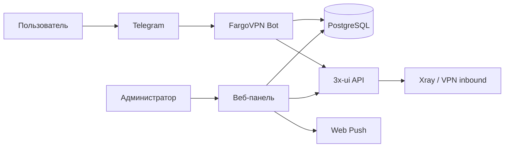
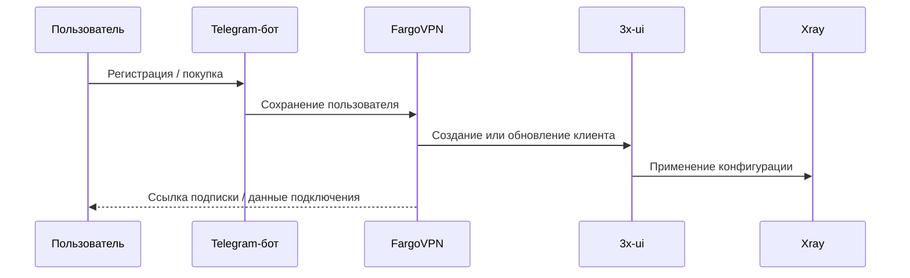
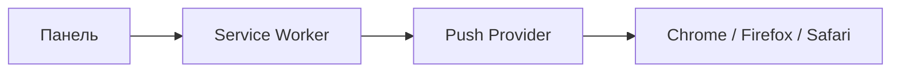
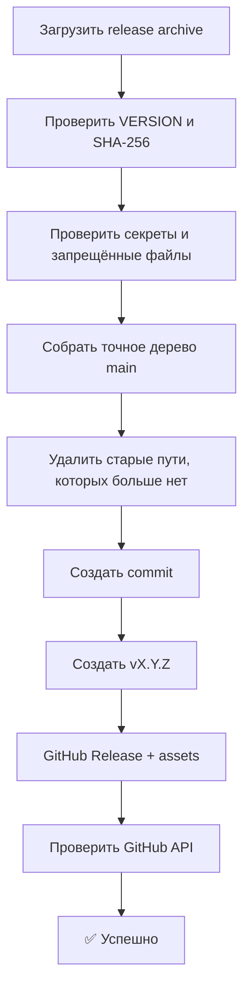
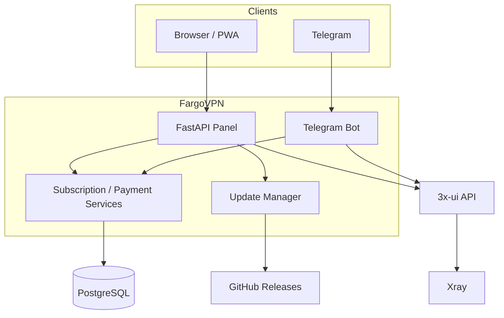

# FargoVPN

> Telegram-бот и веб-панель для продажи и управления VPN-подписками на базе 3x-ui/Xray.

[](https://github.com/Menshikovivan/FargoVPN/releases)
[](https://github.com/Menshikovivan/FargoVPN/actions/workflows/ci.yml)
[](https://www.python.org/)
[](https://telegram.org/)
[](https://github.com/MHSanaei/3x-ui)

**Текущая версия: 5.1.16**

FargoVPN рассчитан на владельцев VPN-сервисов, которым нужен готовый пользовательский Telegram-бот, административная веб-панель, управление подписками через 3x-ui и безопасное обновление без ручной работы с исходниками.

## Содержание

- [Что умеет FargoVPN](#что-умеет-fargovpn)
- [Как это работает](#как-это-работает)
- [Основные возможности](#основные-возможности)
- [Требования](#требования)
- [Быстрая установка](#быстрая-установка)
- [Первичная настройка](#первичная-настройка)
- [3x-ui и подписки](#3x-ui-и-подписки)
- [Оплата](#оплата)
- [Уведомления](#уведомления)
- [Обновления](#обновления)
- [Резервные копии и откат](#резервные-копии-и-откат)
- [Архитектура](#архитектура)
- [Диаграммы](#диаграммы)
- [Структура проекта](#структура-проекта)
- [Диагностика](#диагностика)
- [FAQ](#faq)
- [Безопасность](#безопасность)
- [Документация](#документация)
- [Изменения](#изменения)
- [Лицензия](#лицензия)

## Что умеет FargoVPN

FargoVPN объединяет Telegram-бота и административную панель в одну систему.

Пользователь получает VPN-подписку через Telegram, видит её состояние, получает данные подключения и может открыть личный кабинет. Администратор работает с пользователями, сообщениями, оплатами, подписками, резервными копиями, диагностикой, Web Push и обновлениями.

Серверная часть интегрируется с 3x-ui для работы с VPN-клиентами и inbound-конфигурациями. Для данных FargoVPN используется PostgreSQL, при этом установщик и миграции сохраняют совместимость со старыми установками.

## Основные возможности

| Область | Возможности |
|---|---|
| Telegram | Регистрация, подписки, продление, пользовательские действия и служебные уведомления |
| Личный кабинет | Состояние подписки, срок действия, трафик, ссылка подписки и базовые действия пользователя |
| Админ-панель | Пользователи, сообщения, платежи, настройки, диагностика, резервные копии и обновления |
| 3x-ui | Получение и синхронизация клиентских данных и inbound-конфигураций через API |
| Платежи | Создание и обработка заявок на оплату, хранение состояния платежей и работа с чеками |
| Push | Web Push для браузеров и PWA при настроенных VAPID-ключах |
| Поддержка | Переписка администратора с пользователями из веб-панели |
| Реферальная система | Коды приглашений и вознаграждения при выполнении условий сервиса |
| Backup | Резервные копии FargoVPN, PostgreSQL и связанных служебных данных по штатному профилю |
| Обновления | Проверка GitHub Releases, резервная копия перед обновлением и откат при ошибке |

## Как это работает



## Требования

| Ресурс | Требование |
|---|---|
| ОС | Linux с systemd; штатный сценарий рассчитан на Debian/Ubuntu с `apt` |
| Права | `root` / `sudo` для установки и обновления |
| Python | 3.10+ |
| БД | PostgreSQL для штатной production-схемы FargoVPN |
| 3x-ui | Доступный API 3x-ui и настроенные inbound/client данные |
| Reverse proxy | Внешний Nginx/HTTPS, если панель публикуется в интернет |
| Диск | Запас под Python-окружение, резервные копии, логи и данные пользователей |
| Сеть | Доступ сервера к Telegram API, GitHub Releases, PostgreSQL и 3x-ui |

Штатный установщик автоматически ставит необходимые Linux/Python-зависимости. Внешний Nginx не заменяется автоматически: панель использует локальный Unix-socket, который затем можно публиковать через reverse proxy.

## Быстрая установка

Для уже опубликованных релизов можно использовать стандартный bootstrap:

```bash
curl -fsSL https://raw.githubusercontent.com/Menshikovivan/FargoVPN/main/install.sh | sudo bash
```

Для новой версии до её первой публикации в GitHub Releases используйте локальный release-архив. Распакуйте его на сервере и запустите корневой `install.sh`: он обнаружит соседний `app/VERSION` и установит именно этот архив, не скачивая старый `latest` из GitHub.

```bash
tar -xzf FargoVPN_FULL.tar.gz
cd FargoVPN-5.1.16
sudo ./install.sh
```

Bootstrap загружает последнюю опубликованную версию, проверяет SHA-256 полного release-архива и запускает штатный установщик.

## Первичная настройка

После установки откройте веб-панель и заполните основные параметры.

### Что понадобится

| Настройка | Где используется |
|---|---|
| Telegram Bot Token | Работа Telegram-бота |
| PostgreSQL DSN | База данных FargoVPN |
| 3x-ui URL / API | Создание и получение VPN-клиентов |
| Публичный URL | Ссылки панели и пользовательских сервисов |
| Данные оплаты | Инструкция и обработка платежных заявок |
| Web Push | Браузерные уведомления администратора |
| GitHub token | Публикация новых релизов из панели |

Секретные значения хранятся на сервере и не должны добавляться в Git.

## 3x-ui и подписки

FargoVPN использует API 3x-ui для работы с клиентами и данными inbound. Конкретный способ публикации подписки зависит от настроенных inbound и существующей конфигурации 3x-ui.

Рабочий поток выглядит так:



## Оплата

В панели можно хранить и обрабатывать платежные заявки. В проекте также есть работа с изображениями чеков и OCR-контуром для локальной проверки данных чека.

Рекомендуемый порядок:

1. Настройте реквизиты в панели.
2. Проверьте создание тестовой заявки.
3. Проверьте загрузку чека.
4. Убедитесь, что после подтверждения платежа подписка пользователя обновляется.

## Уведомления

FargoVPN поддерживает Web Push для администраторской панели. Для браузерных уведомлений нужен HTTPS и корректно настроенная пара VAPID-ключей.



Приватный VAPID-ключ не хранится в репозитории.

## Обновления

### Через панель

Откройте раздел **Обновления** и проверьте доступную версию. Панель получает данные из реального GitHub Release, скачивает архив, проверяет его и запускает обновление в фоне.

Во время установки отображаются текущий этап, процент и состояние задачи. Перед заменой файлов создаётся резервная копия.

### Через консоль

```bash
sudo /root/vpn_bot/install.sh --update-existing /root/vpn_bot
```

Для другой установки укажите фактический путь вместо `/root/vpn_bot`.

### Что сохраняется

При штатном обновлении сохраняются production-конфигурация, база данных, логи, виртуальное окружение и резервные копии. Исходный код обновляется до нового release-пакета.

### Публикация новой версии из панели

В FargoVPN есть отдельный release-flow для администратора проекта:



После публикации `main` содержит только исходники и документацию из новой версии. Release-архивы находятся в GitHub Release assets, а не в дереве `main`.

## Резервные копии и откат

До обновления устанавливается pre-update backup и сохраняется состояние systemd.

При нештатном обновлении используется rollback-механизм. Для production рекомендуется дополнительно иметь собственную копию PostgreSQL и конфигурации сервера.

## Архитектура



## Структура проекта

```text
FargoVPN/
├── install.sh                # публичный bootstrap-установщик
├── README.md                 # эта документация
├── diagnose.sh               # read-only диагностика для запуска из release-архива
├── LICENSE                   # лицензия проекта
├── .github/                  # CI, шаблоны Issues/PR, Dependabot
├── app/                      # runtime FargoVPN и полный installer
│   ├── install.sh
│   ├── VERSION
│   ├── main.py
│   ├── webapp.py
│   ├── update_manager.py
│   ├── services/
│   ├── static/
│   ├── migrations/
│   └── systemd/
├── docs/                     # пользовательская и эксплуатационная документация
├── scripts/                  # диагностические и административные утилиты
└── tests/                    # автоматические проверки
```

Production-файлы установки не обязаны совпадать с Git-структурой: штатный installer разворачивает содержимое `app/` в рабочий каталог `/root/vpn_bot` или указанный путь.

## Диагностика

### Службы

```bash
sudo systemctl status vpn-service-bot.service
sudo systemctl status vpn-service-web.service
sudo systemctl status vpn-service-web.socket
```

### Логи

```bash
sudo journalctl -u vpn-service-bot.service -n 200 --no-pager
sudo journalctl -u vpn-service-web.service -n 200 --no-pager
sudo tail -n 200 /var/log/vpn_bot.log
```

### Версия

```bash
cat /root/vpn_bot/VERSION
```

### Read-only диагностика

```bash
# из release-архива
sudo bash ./diagnose.sh --json

# после установки
sudo bash /root/vpn_bot/scripts/diagnose.sh --json
```

Диагностика не изменяет GitHub: внешние GitHub-запросы из неё выполняются только методом GET. Итоговый отчёт сохраняется в приватном файле; токены и ключи маскируются.

### Проверка сервера

На установленном сервере доступны штатные диагностические утилиты из `app/` и `scripts/`. Они не должны содержать токены или пароли в результатах.

## FAQ

### Где хранится пароль панели?

На сервере хранится хэш пароля в `config.py`. Сам файл `config.py` не должен находиться в Git.

### Где хранится Telegram Token?

Только на сервере в production-конфигурации.

### Нужен ли Nginx?

Для публичного HTTPS-доступа к панели — обычно да. Сам FargoVPN использует локальный Unix-socket веб-службы.

### Можно ли обновляться со старой установки?

Да. Штатный installer рассчитан на обновление существующей установки с сохранением production-данных.

### Что делать, если обновление не завершилось?

Проверьте статус задачи в разделе «Обновления», затем состояние systemd и журнал `/var/log/vpn_bot.log`. При необходимости используйте встроенный rollback.

## Безопасность

Не размещайте в репозитории:

- Telegram Bot Token;
- GitHub token;
- пароли 3x-ui и панели;
- VAPID private key;
- `.env` и production `config.py`;
- базы данных и backup-архивы.

Подробнее: [политика безопасности](docs/security/SECURITY.md).

## Документация

- [Эксплуатация](docs/operations.md)
- [Миграция PostgreSQL](docs/postgresql-migration.md)
- [Безопасность](docs/security/SECURITY.md)
- [Для разработчиков](docs/contributing/CONTRIBUTING.md)
- [Изменения](docs/releases/CHANGELOG.md)
- [Скриншоты](docs/screenshots/README.md)

## Изменения

Подробная история релизов: [CHANGELOG.md](docs/releases/CHANGELOG.md).

## Лицензия

Проект распространяется по лицензии, указанной в [`LICENSE`](LICENSE).
